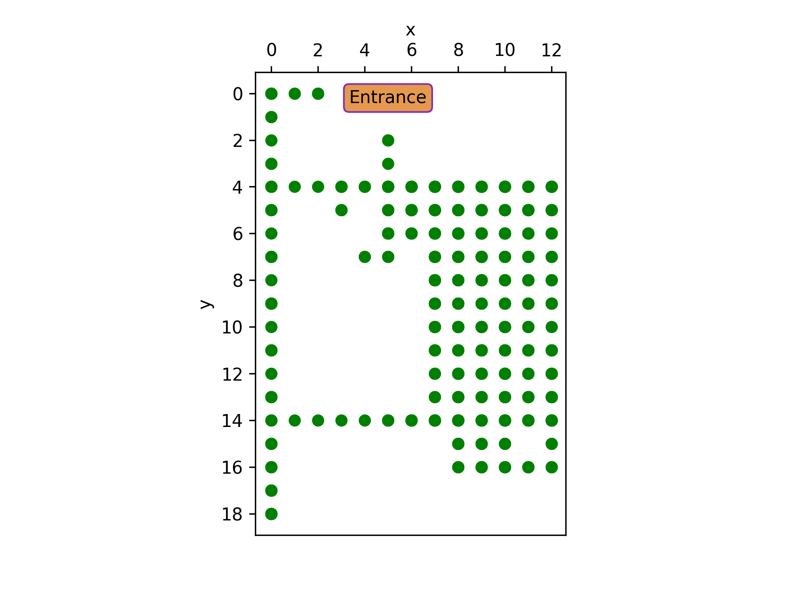
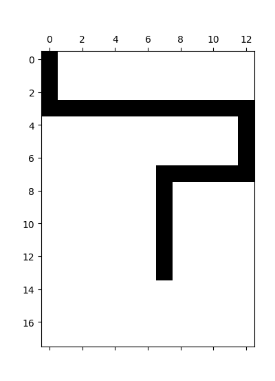
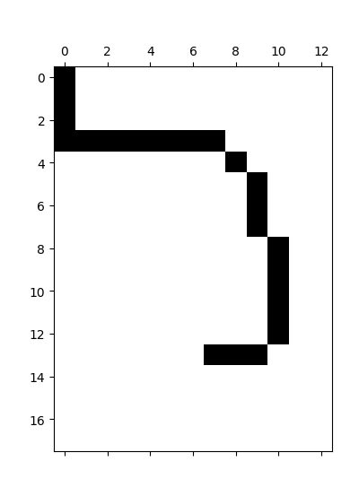
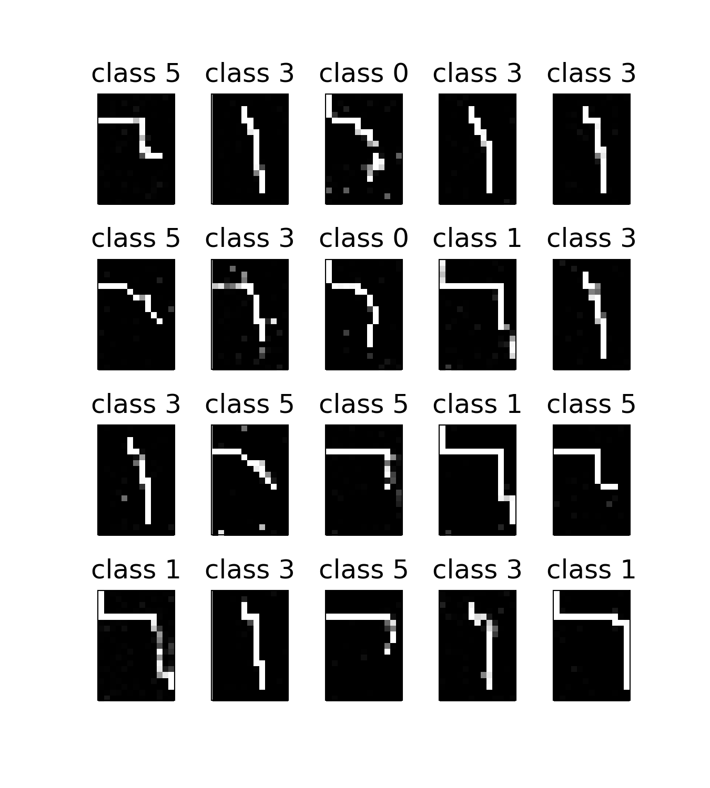

Path Planning using Generative Adversarial Network (GAN)
================================
Inspired by the successful application of GANs in producing artificial images, we apply this technique to generate paths between two points that can be used in services such as path planning, wayfinding, and navigation based on a set of previous traces of commuters. 
The implementation of GAN is adopted from [Keras-GAN](https://github.com/eriklindernoren/Keras-GAN). 

As the proof of concept, we used this technique for path planning in an indoor environment that is equipped with BLE iBeacons. The public access area where paths are allowed are according to the green points at the following layout:

Here are the sample of the trjectories: 

 

The generated paths are classified based on six different paths that are defined.

Dataset
---------
The training data presents the trajectories of users in an indoor building. 
The dataset and its description is available at [Kaggle.com](https://www.kaggle.com/mehdimka/path-planning).

Requirements:
---------------

- numpy
- pandas
- keras
- sklearn

Citation:
-----------
Please cite our work when using our software or dataset in your own research or publication.
* Mohammadi, Mehdi, Ala Al-Fuqaha, and Jun-Seok Oh. "Path Planning in Support of Smart Mobility Applications using Generative Adversarial Networks." arXiv preprint arXiv:1804.08396 (2018).

 

